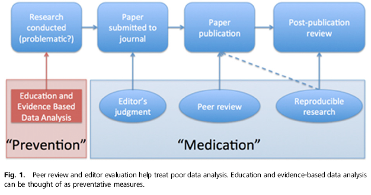

## What is this talk about?

- This is intended to be a discussion not about *what* we do, 
    - but about *how* we do it
- I will touch on instances when our colleagues get their results wrong (either by accident or intentionally)
    - Raises the question of **how do others find out** if science is wrong
- I suggest the same methodology that makes it possible to identify incorrect science
    - can be used to reduce likelihood of science being done incorrectly

##  Purpose of reproducibility in science

- Why should research be reproducible?
    + What if research is **not** reproducible?
- Scientific papers have **Methods** sections
    - Other researchers can determine how findings were deduced
- If finding is reproduced in numerous situations, role of chance in the result is reduced
    + Some fields demand a scientist replicate their own findings before publication

## Sound familiar?
- A way to make *your* statistical research **irreproducible**
    + Use different tools for each phase of the research
        - Data management and transformation in a spreadsheet
        - Analysis and modelling using stats software
        - Narrative of the report in a word processor
        - Figures in graphics software
    + Many opportunities for errors to occur
    + No audit trail to track what changes were made to data
- What happens if new data arise, or if data need to be corrected?
    + Entire process must be repeated
- Unlikely the researcher can reproduce the process
    + Virtual certainty no one else could either

## Irreproducible results

- This used to be funny
- 

##  Humorous no longer
>- [Scientific dishonesty](http://retractionwatch.com/) has entered the public eye

-

-https://nsaunders.wordpress.com/2015/03/24/pubmed-retraction-reporting-update/

## Examples of results that could not be duplicated

Note, the next two clippings are from newspapers, not scientific journals


## Shady dealings in the world of medicine and grantsmanship


http://www.forbes.com/sites/fayeflam/2015/01/22/investigator-offers-lessons-from-precision-medicines-cancer-scandal/

---


http://retractionwatch.com/2012/02/14/the-anil-potti-retraction-record-so-far/

## Statisticians wearing white hats


## Example of erroneous finding; dangerously close to home
>-

- 
- *The article presented broad-scale patterns of species distribution shifts in response to recent climate change. Unfortunately, it has since been found that one approach used to account for sampling bias, the null model approach,* **was affected by the coding error.**

- http://www.nature.com/news/rule-rewrite-aims-to-clean-up-scientific-software-1.17323 *(with thanks to Rob Schick)*

# A parable about trying to do the right thing

##  How statistical analysis really happens 
### (contrary to what we tell our students)


Hadley Wickham, Simply Statistics Unconference
http://t.co/D931Og8mq3

##  How statistical analysis really happens 
### (contrary to what we tell our students)

 

Hadley Wickham, Simply Statistics Unconference
http://t.co/D931Og8mq3


http://www.quora.com/What-is-data-munging

I had to explain this concept to students

## A *Biostatistics* paper about false discovery rates

  


##  Jager and Leek paper attracts attention

- Short synopsis of their paper
    + Scraped data from abstracts of >70,000 published papers
    + Estimated *science-wise false discovery rate*
    + Looked for temporal trends in this quantity
- 
- http://biostatistics.oxfordjournals.org/content/15/1.toc


## Jager and Leek used the tools of reproducible research

- They were posing the question
    + *what proportion of published findings are incorrect?*
- Jager and Leek could not fully scrutinise the science behind all >70,000 papers
- If they could examine data underlying all the studies, they could make an assessment of proportion of conclusions that were wrong
- As an object lesson, code and data [online](https://github.com/jtleek/swfdr)
    + Others could assess whether they had performed their analysis properly
    + Consistent with idea that assessment of research can only occur when data and code are shared

## Weaponising reproducibility

- Unintended consequences of making their analysis available
- 
- Leek's conclusion
- 

- http://simplystatistics.org/2015/03/13/de-weaponizing-reproducibility/

## Is reproducibility universally good?

- US House of Representatives has passed this piece of legislation
-  
- now before the U.S. Senate

## Does anybody care about this?
- US National Research council of the National Academy of Sciences
    + hosted workshop 26-27 Feb 2015 entitled
    + *Statistical challenges in assessing and fostering the reproducibility of scientific results*
- 

##  Watch the entire workshop
<iframe width="1024" height="768" src="https://www.youtube.com/embed/ZAfk8GbznPA?feature=player_embedded" frameborder="0" allowfullscreen></iframe>
http://sites.nationalacademies.org/DEPS/BMSA/DEPS_153236

## What about on this side of the pond?


*The Academy of Medical Sciences, jointly with the BBSRC, MRC and Wellcome Trust, held a symposium on 1-2 April 2015 to explore the challenges and opportunities for improving the reproducibility and reliability of biomedical research in the UK.*

http://www.acmedsci.ac.uk/policy/policy-projects/reproducibility-and-reliability-of-biomedical-research/

## What does this have to do with me?

- Student
    + You should learn about the controversies of research practices
        + Hopefully some of you will engage in this soon
        + If these beliefs are adopted as best practices
            - Your acquaintance with them will serve you for job interviews
    + You may be able to put some of these practices to use in your modules
- Post-doc/faculty
    + Proximate
        + Publication policies of journals are under review
        + Many journals in which we now publish accept *supplemental* material
        + How long before that material becomes compulsory and part of the review process?
    + Ultimate
        + Controversies are part of your discipline
        + Controversies colour the manner in which public perceives science

## Glimpse at reproducible research tools

### Github
- I already showed the github repository site for the Jager and Leek paper
- The Distance project has a [repository](https://github.com/DistanceDevelopment)
- Repos can be shared with colleagues during project development
    + Changes to code and/or data are documented
    + The process of conducting research/analysis is clear to see
- They can also serve as long-term archives for projects past
    + Steve asked a few weeks ago to reconstruct figure from paper published 3 years ago

## Recall this scenario
>- A way to make statistical research **irreproducible**
    + Use different tools for each phase of the research
        - Data management and transformation in a spreadsheet
        - Analysis and modelling using stats software
        - Narrative of the report in a word processor
        - Figures in graphics software
    + Many opportunities for errors to occur
    + No audit trail to track what changes were made to data
- What happens if new data arise, or if data need to be corrected?
    + Entire process must be repeated
- Unlikely the researcher can reproduce the process
    + Virtual certainty no one else could either

## Markdown 

- An example of some Markdown code
- 

## Transforms into 

Obtain an estimate of probability of occupancy per site $(\Psi)$, together with an approximate 95% confidence interval for this probability, assuming perfect detection of the species within each site.

```{r, 4a, warning=FALSE, message=FALSE}
library(RMark, quietly=TRUE)
data(Donovan.7)
N.total <- dim(Donovan.7)[1]
T.occ <- nchar(Donovan.7$ch[1])
n.occupied <- sum(Donovan.7$ch!="00000")
Psi.0 <- n.occupied/N.total
Psi.0.ci <- Psi.0 + c(-1.96,1.96)*sqrt(Psi.0*(1-Psi.0)/N.total) # assuming normality
```
Based upon `r n.occupied` of the `r N.total` sites occupied, the estimate of occupancy is `r Psi.0` with a confidence interval (assuming normality) of (`r round(Psi.0.ci,3)`).

<hr>

Without fitting a model, decide whether the maximum likelihood estimates of an occupancy model fitted to these data assuming constant detection probability p, satisfy these equations:

$$\hat{\Psi} = \frac{n}{N\hat{p_.}} $$

$$\frac{\hat{p}}{\hat{p_.}} = \frac{\delta_{..}}{nT}$$


## Making irreproducibility a thing of the past
### Editorial policy of journals


---


> An increasing number of initiatives aim to encourage scientists to ensure that their software is replicable. Courses run by organizations such as the non-profit Software Carpentry Foundation teach the value of writing and sharing solid scientific code, as well as the principles of constructing it. Software packages such as iPython and knitr make it easier to document code creation transparently and in its research context.

http://www.nature.com/news/rule-rewrite-aims-to-clean-up-scientific-software-1.17323

## How can statisticians address the reproducibility issue?


## Fix "challenged" science when it is conducted
### not when it is reported

One proposal coming from the National Academy workshop:



Leek and Peng 2015: Proceedings of National Academy of Science http://www.pnas.org/cgi/doi/10.1073.pnas.1421412111
<!--
## Conflation of public perceptions of science, P-values and reproducibility

 

http://www.nature.com/news/statistics-p-values-are-just-the-tip-of-the-iceberg-1.17412
-->

## Summary

- Reproducible research is the way of research in the 21^st^ century
- The costs of performing research poorly are too high
- I hope I have made you aware of
    + current controversies that confront research, and 
    + tools to alleviate these challenges
-  For reproducibility
    + Rmarkdown file is here https://copy.com/Ok2utsmHAtL7WX6A
- Stay tuned for details regarding a workshop delivered in this room the **week of 15 June**
    - by Software Carpentry Foundation
